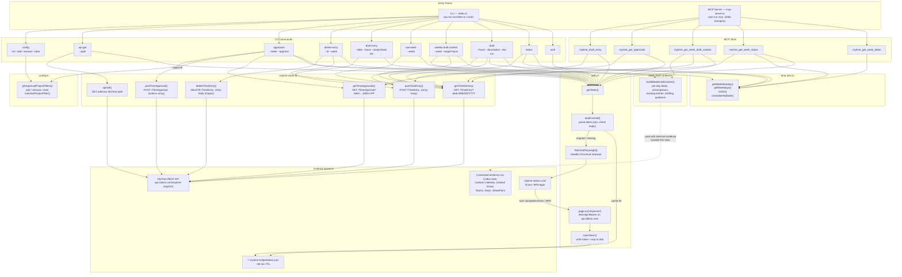
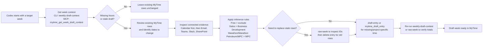

# Architecture

## System overview

```mermaid
flowchart TD
    subgraph Entrypoints["Entry Points"]
        CLI["CLI — index.ts\nnpx tsx src/index.ts &lt;cmd&gt;"]
        MCP["MCP Server — mcp-server.ts\nnpm run mcp  (stdio transport)"]
    end

    subgraph CLICmds["CLI Commands"]
        cmd_auth["auth"]
        cmd_status["status"]
        cmd_draft["draft\n--hours --description --dry-run"]
        cmd_weekctx["weekly-draft-context\n--week --target-hours"]
        cmd_raw["raw-week\n--week"]
        cmd_draftentry["draft-entry\n--date --hours --project/task ids"]
        cmd_delete["delete-entry\n--id --week"]
        cmd_approvals["approvals\n--week --approve"]
        cmd_apiget["api-get\n--path"]
        cmd_config["config\nlist / add / remove / clear"]
    end

    subgraph MCPTools["MCP Tools"]
        t_dates["mytime_get_week_dates"]
        t_status["mytime_get_week_status"]
        t_weekctx["mytime_get_week_draft_context"]
        t_approvals["mytime_get_approvals"]
        t_draft["mytime_draft_entry"]
    end

    subgraph AuthMod["auth.ts"]
        getToken["getToken()"]
        loadCached["loadCached()\nparse token.json, check expiry"]
        fetchPW["fetchViaPlaywright()\nheadful Chromium browser"]
        interceptor["page.on('response')\nintercept Bearer on api.slalom.com"]
        saveToken["saveToken()\nwrite token + exp to disk"]
    end

    subgraph Client["mytime-client.ts"]
        getEntries["getTimeEntries()\nGET /TimeEntry?date=MM/DD/YYYY"]
        getApprovs["getTimeApprovals()\nGET /TimeApproval?date=…&filter=PP"]
        postEntry["postTimeEntry()\nPOST /TimeEntry  (array body)"]
        deleteEntry["deleteTimeEntry()\nDELETE /TimeEntry  (retry body shapes)"]
        apiGet["apiGet()\nGET arbitrary MyTime path"]
        postApprov["postTimeApproval()\nPOST /TimeApproval  (actions array)"]
    end

    subgraph Utils["time-utils.ts"]
        weekUtils["getWeekMonday()\ngetWeekdays()\ntoISO()\nnormalizeApiDate()"]
    end

    subgraph DraftCtx["week-draft-context.ts"]
        buildCtx["buildWeekDraftContext()\nper-day totals, missingHours,\nexisting entries, drafting guidance"]
    end

    subgraph Cfg["config.ts"]
        cfgUtils["getApprovalProjectFilters()\nadd / remove / clear\nmatchesProjectFilter()"]
    end

    subgraph External["External Systems"]
        tokenFile["~/.mytime-helper/token.json\n~90 min TTL"]
        myTimeWeb["mytime.slalom.com\nEntra / MFA login"]
        API["MyTime REST API\napi.slalom.com/mytime-2/api/V1/"]
        evidence["Connected evidence via Codex tools:\nOutlook Calendar, Outlook Email,\nTeams, Slack, SharePoint"]
    end

    %% Entry → Commands / Tools
    CLI --> cmd_auth & cmd_status & cmd_draft & cmd_weekctx & cmd_raw & cmd_draftentry & cmd_delete & cmd_approvals & cmd_apiget & cmd_config
    MCP --> t_dates & t_status & t_weekctx & t_approvals & t_draft

    %% CLI commands → shared modules
    cmd_auth      --> getToken
    cmd_status    --> getToken & weekUtils & getEntries
    cmd_draft     --> getToken & weekUtils & getEntries & postEntry
    cmd_weekctx   --> getToken & getEntries & buildCtx
    cmd_raw       --> getToken & getEntries
    cmd_draftentry --> getToken & postEntry
    cmd_delete    --> getToken & getEntries & deleteEntry
    cmd_approvals --> getToken & weekUtils & getApprovs & cfgUtils
    cmd_approvals -->|"--approve"| postApprov
    cmd_apiget    --> getToken & apiGet
    cmd_config    --> cfgUtils

    %% MCP tools → shared modules
    t_dates     --> weekUtils
    t_status    --> getToken & weekUtils & getEntries
    t_weekctx   --> getToken & getEntries & buildCtx
    t_approvals --> getToken & getApprovs
    t_draft     --> getToken & postEntry

    %% Auth flow
    getToken --> loadCached
    loadCached -->|"cache hit"| tokenFile
    loadCached -->|"expired / missing"| fetchPW
    fetchPW --> myTimeWeb
    myTimeWeb -->|"user completes Entra / MFA"| interceptor
    interceptor --> saveToken --> tokenFile

    %% API calls
    getEntries & getApprovs & postEntry & deleteEntry & apiGet & postApprov --> API

    %% Weekly drafting context
    buildCtx -. "used with external evidence\noutside this repo" .-> evidence
```

## Weekly draft and refresh flow

```mermaid
flowchart LR
    start["Codex starts with a target week"] --> ctx["Get week context\nCLI: weekly-draft-context\nMCP: mytime_get_week_draft_context"]
    ctx --> gaps{"Missing hours\nor stale draft?"}
    gaps -->|No| done["Leave existing MyTime rows unchanged"]
    gaps -->|Yes| review["Review existing MyTime rows\nand identify dates to change"]
    review --> evidence["Inspect connected evidence\nCalendar first, then Email,\nTeams, Slack, SharePoint"]
    evidence --> rules["Apply inference rules\nFree = exclude\nSales = Business Development\nMarathon/Marathon Petroleum/MPC = MPC"]
    rules --> rewrite{"Need to replace stale rows?"}
    rewrite -->|Yes| raw["raw-week to inspect IDs\nthen delete-entry for old rows"]
    rewrite -->|No| create["draft-entry or mytime_draft_entry\nfor missing/project-specific time"]
    raw --> create
    create --> verify["Re-run weekly-draft-context\nor raw-week to verify totals"]
    verify --> done2["Draft week ready in MyTime"]
```
