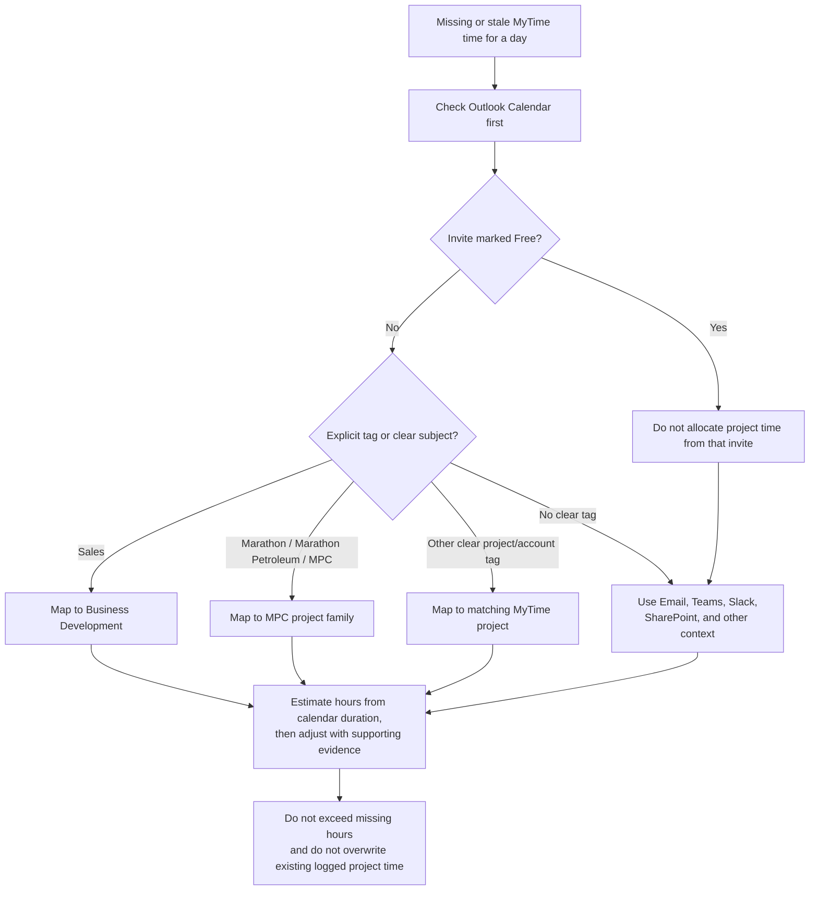

# Inference Rules

These rules define how Codex should infer weekly MyTime drafts from connected tools when exact project logging is missing.

## Decision flow

## Source priority

Use evidence in this order when deciding where time should go:

1. Outlook Calendar
2. Outlook Email
3. Teams
4. Slack
5. SharePoint
6. Other connected context available in-session

Calendar tags are the strongest signal when they are explicit.

## Core assumptions

- Codex should make a reasonable project and hours allocation instead of defaulting all missing time to generic Available time.
- The goal is to produce a plausible first draft that the user can quickly review.
- Hours do not need to be exact to the minute. Reasonable approximations based on activity volume, meeting duration, and follow-up load are preferred.
- If multiple sources point to the same project on the same date, increase confidence in that allocation.

## Calendar tag mapping

- `Sales` means business development.
- `Marathon`, `Marathon Petroleum`, and `MPC` should be treated as the same project family and mapped to the MPC MyTime project unless stronger evidence points elsewhere.
- Calendar items marked `Free` should not be allocated to any project based on calendar time alone.
- Explicit customer, account, opportunity, initiative, or internal program tags should generally map to the corresponding MyTime project when the related project is already evident from surrounding context.
- If a day contains several clearly tagged blocks, split time proportionally using the calendar as the primary anchor and other tools as supporting evidence.

## Hour estimation guidance

- Use calendar duration as the starting point, not the final answer.
- Exclude any calendar invite whose show-as / availability status is `Free` from project-hour allocation.
- Add reasonable surrounding time for prep, follow-up, email, chat, document work, and coordination when other evidence supports it.
- If there is substantial Slack, Teams, email, or SharePoint activity for a project but little calendar time, assign some of the missing hours to that project.
- Do not assign more than the day's missing hours.
- Do not rewrite or override hours that are already logged in MyTime.

## Guardrails

- Do not invent a project that is unsupported by the evidence.
- If signals are weak, prefer a broad but truthful description over a highly specific one.
- If the date appears to include PTO, holiday, or clearly non-working time, do not force-fill it as project time.
